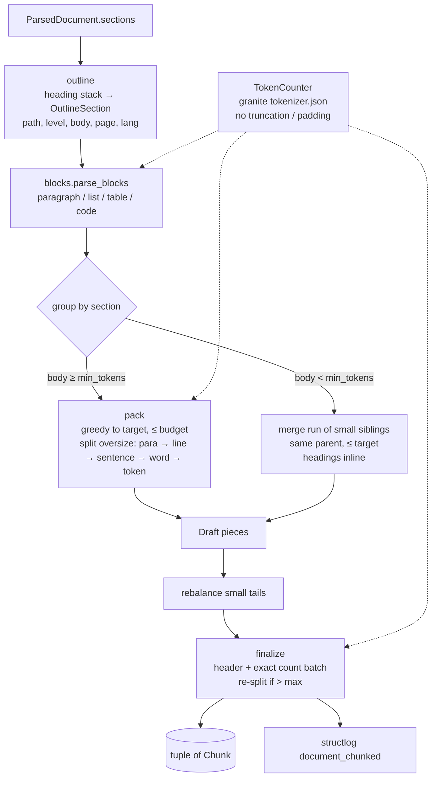

# Design Document: Chunking

## Overview

One pure, synchronous entry point:

```python
chunk_document(doc: ParsedDocument, *, settings: IngestSettings | None = None,
               counter: TokenCounter | None = None) -> tuple[Chunk, ...]
```

The pipeline (`ingest/pipeline.py`, separate spec) calls it in `asyncio.to_thread` right after
`preprocess_*`, then embeds `chunk.embed_text` (dense + BM25 via `fold_for_search`) and stores `text`
plus metadata as the Qdrant payload.

The algorithm, in four passes:

1. **Outline.** Rebuild the heading tree from the `#` lines that `sections.split_markdown` already
   keeps at the top of each section. Each section gets a `heading_path` and a body without its own
   heading line.
2. **Blocks.** Parse each body into blocks (paragraph, list, table, code fence) so that atomic
   structures are never cut by accident.
3. **Group.** Walk the sections in order. A large section is packed into one or more pieces. Runs of
   small sections under the same parent are merged into one piece.
4. **Finalize.** Prepend the contextual header, count tokens exactly with the embedder tokenizer,
   re-split anything over `max_tokens`, and assign `index`, pages, language and `section_index`.

### Measurements that shaped the design

All measurements were taken on 2026-10-10 against `data/parsed/*.md` with the real tokenizers
(throw-away script, nothing committed).

| Finding | Consequence |
|---|---|
| granite `tokenizer.json` ships with **truncation at 32,768 tokens and padding enabled**. Encoding the BBC page 20 times gave exactly 32,768 tokens until `no_truncation()` was called (77,960 after). | `HFTokenCounter` calls `no_truncation()` and `no_padding()` on load. A unit test asserts that a 40k-token text counts above 32,768. |
| Characters per granite token: 2.8 to 3.0 for Arabic articles, 3.6 for the docs page (CSS variables), 4.6 for the English PDF. | Character-based sizing would make Arabic chunks about 1.6× larger in tokens than English ones. Count tokens (Req 6.1). |
| Reranker (bge-reranker-v2-m3, XLM-R) tokens ÷ granite tokens: 0.83 to 0.88 for Arabic, 1.06 for English prose, **1.28 for the code-heavy docs page**. | A 450 granite-token chunk can be about 576 reranker tokens, which is over the 512-token default before the query is even added. **Defaults lowered to target 300 / max 400** (Req 6.3 updated). The retrieval spec must still set the reranker `max_length` to at least 640 (400 × 1.28 + 128 query tokens). |
| `encode_batch` over 3,281 paragraphs (1.2 MB of Arabic) took 0.06 s, and a single 1.2 MB encode took 0.22 s. | Batch-encode every unit once and sum the counts while packing (Req 8.2). Exact re-counting happens only once, on the final chunks. |
| Encodings expose character `offsets`. Arabic `؟` is its own token. | A token-boundary hard split can cut at an offset without decoding, so the text stays byte-faithful. |
| The slide-style PDF gives 44 sections, most under 60 characters (`## 01`, `## 1`, `## 07`). The docs page gives a clean H1 > H2 > H3 tree. The Arabic article has H2 sections of 400 to 1,500 tokens and no H1. | This motivates small-section merging (Req 4), multi-level paths (Req 2.2), and paragraph/sentence splitting (Req 3). |

## Architecture



The budget for the body is `budget = max_tokens - header_tokens(path)`, computed per heading path
and cached, because every chunk in a section shares the same header.

## Components and Interfaces

| File | Responsibility | Key interface |
|---|---|---|
| `ingest/models.py` (extend) | `Chunk` model next to `ParsedDocument` | `Chunk` (see Data Models) |
| `ingest/settings.py` (extend) | `chunk_*` fields and their validation | `IngestSettings.chunk_*`, `chunking_signature(settings, counter) -> str` |
| `ingest/tokens.py` (new) | Token counting with the embedder tokenizer | `TokenCounter` protocol, `HFTokenCounter`, `verify_tokenizer(settings) -> Path`, `get_token_counter(settings)` (cached) |
| `text/sentences.py` (new) | Multilingual sentence and word splitting, lossless | `split_sentences(text) -> list[str]`, `split_words(text) -> list[str]` |
| `ingest/chunk.py` (new) | Outline, blocks, grouping, packing, finalize, logging | `chunk_document(doc, *, settings=None, counter=None)` |
| `ingest/errors.py` (extend) | Startup error when the tokenizer is missing | `TokenizerConfigError(IngestError)`, code `tokenizer_config_error` |
| `scripts/download_models.py` (extend) | Pinned, sha256-verified `tokenizer.json` download | `download_tokenizer(dest)`, `--only tokenizer` |

### `ingest/tokens.py`

```python
class TokenCounter(Protocol):
    def count(self, text: str) -> int: ...
    def count_many(self, texts: Sequence[str]) -> list[int]: ...
    def cut(self, text: str, max_tokens: int) -> tuple[str, str]: ...  # split at a token offset
    @property
    def fingerprint(self) -> str: ...  # sha256 of tokenizer.json, for chunking_signature

class HFTokenCounter:
    def __init__(self, path: Path):  # Tokenizer.from_file; no_truncation(); no_padding()
```

- `count*` use `add_special_tokens=False`. The embedder adds CLS/SEP itself, and the header margin
  absorbs those 2 tokens (`max_tokens=400` is well under the model's 32k and the reranker's 640).
- `cut()` encodes once and uses `offsets[max_tokens - 1][1]` as the character cut. Both halves are
  exact substrings, so `head + tail == text`.
- `verify_tokenizer()` mirrors `ocr.verify_tessdata()`: if the file is missing or unreadable it
  raises `TokenizerConfigError` with the command to run
  (`uv run python scripts/download_models.py --only tokenizer`).
- Pinned source: `ibm-granite/granite-embedding-311m-multilingual-r2` revision
  `44399559930365213510b1ee2eb15ded83374f0e`, `tokenizer.json`, sha256
  `0087c868b33bad550a78a08d19798cfd7f713cde4f020803b8f51f405503e15f` (33.4 MB). Default path
  `$MODELS_DIR/embedder/tokenizer.json`. The pipeline spec later puts the ONNX model in the same
  directory.

### `text/sentences.py`

Pure regex, no new dependency. pysbd has no Arabic rules, and the Arabic RAG study only needs
punctuation-aware boundaries.

- A boundary comes **after** a terminator run `[.!?…؟؛۔]+`, optionally followed by closing
  `"'»”’)]`, and must be followed by whitespace or the end of the text.
- **Not** a boundary when the terminator is `.` and either:
  - the previous token is in an abbreviation set (`e.g`, `i.e`, `etc`, `M`, `Mme`, `Dr`, `Pr`,
    `p`, `cf`, `vs`, `n°`, plus one-letter capitals for initials), or
  - the next character is a digit or lowercase Latin letter (catches `3.5`, `v1.2`, `example.com`).
    Arabic has no case, so for Arabic text only the abbreviation and digit rules apply.
- The returned pieces keep their trailing whitespace, so `"".join(split_sentences(t)) == t`.
  This is the property the coverage test relies on (Req 1.3).
- `split_words` splits after whitespace runs, also lossless.

### `ingest/chunk.py`: internals

```python
@dataclass(frozen=True)
class _OutlineSection:  # one per input Section, in order
    index: int
    path: tuple[str, ...]  # full heading path incl. own heading
    level: int | None  # own heading level, None if it continues/has none
    heading_line: str | None  # e.g. "## 01", kept for inline use when merged
    body: str  # section text minus its heading line
    page: int | None
    language: str | None


@dataclass(frozen=True)
class _Block:
    kind: Literal["para", "list", "table", "code"]
    text: str
    tokens: int


@dataclass
class _Draft:  # becomes a Chunk in finalize
    path: tuple[str, ...]
    parts: list[str]  # joined with "\n\n"
    sections: list[_OutlineSection]
```

**Outline (Req 2.2, 2.3, 2.5)**

- Keep a stack of `(level, heading)`. For each section:
  - If its first line matches `_HEADING` (reuse the regex from `sections.py`), pop entries with
    `level >= N`, push `(N, heading)`, and use the rest of the text as `body`.
  - Else if `section.heading` is set, differs from the stack top, and the text has no heading line
    (the XLSX sheet case), reset the stack to `[(1, sheet_name)]`.
  - Else (a PDF page continuing a heading, or text before the first heading) inherit the current
    stack.
- `path = tuple(h for _, h in stack)`. The document title is not part of `path`. It is added only in
  the header (Req 5.1).

**Blocks (Req 3.4)**

A line scanner over the body:

- ```` ``` ```` / `~~~` opens a code block until the matching fence.
- Consecutive lines starting with `|` form a table.
- Consecutive lines matching `^\s*([-*+•]|\d+[.)])\s` form a list, including indented continuation
  lines.
- Everything else, separated by blank lines, forms a paragraph.
- XLSX bodies (one `Header: value · …` line per row) parse as one paragraph of row lines. Row lines
  are atomic because the line level comes before the sentence level (Req 2.5).

All block texts are batch-counted once.

**Grouping (Req 2.1, 4)**

Walk the outline sections with a cursor.

- **Heading-only section** (empty body) whose next section is a descendant (its path extends this
  path): skip it. Its heading lives on in the descendants' `heading_path`.
- **Small section** (`body_tokens < min_tokens`, heading-only included): open a merge group with
  `parent = path[:-1]`. Keep adding following sections while all of these hold:
  - the next section's path starts with `parent` (Req 4.3: never crosses a higher heading),
  - the next section is itself small, or the group is still under `min_tokens` (so runs of tiny
    slide sections become one chunk, not several minimum-sized ones),
  - group + next ≤ `target_tokens`.

  Inside the group each section contributes `heading_line + "\n" + body`, so headings stay inline
  (Req 4.2). The draft path is the longest common prefix of the members' paths.

  If the group is still under `min_tokens` when it closes, try to append it to the previous draft
  (only if that draft has the same `parent` prefix and stays ≤ budget). Otherwise emit it as is
  (Req 4.4). A trailing heading-only section is always appended to the previous draft (Req 4.5).
- **Large section:** `pack(blocks, budget)`.

**Pack (Req 3.1, 3.2, 3.5)**

- Greedily add blocks while `sum + sep ≤ target`, and close the piece when the next block would pass
  `target` (if the piece is non-empty) or `budget` (always). `sep` is the token count of `"\n\n"`,
  measured once.
- A block larger than `budget` is split by `_split_unit(text, level)`. The levels are tried in order
  `para → line → sentence → word → token`, and each level splits only the pieces that are still too
  large.
  - Tables split at row lines, with the header and `|---|` separator rows prepended to every piece
    (the repeated header is the only allowed duplication; the coverage test exempts it).
  - Code and list blocks split at line level.
  - The token level uses `counter.cut`, and each use logs `chunk_hard_split`.
- **Rebalance:** if the last piece of a section is under `min_tokens` and has a predecessor, and the
  two together fit `budget`, join them. Otherwise move whole units from the end of the predecessor
  to the tail until the tail reaches `min_tokens` or the predecessor would drop under it.

**Finalize (Req 1, 3.6, 5, 7)**

- `header = " > ".join(dedupe_consecutive([doc.title, *path]))`. If it is over `max_header_tokens`,
  drop entries from the left until it fits, then `counter.cut` the remainder.
- `embed_text = header + "\n\n" + text` (or `text` when `chunk_context_header=False`).
- Batch-count every `embed_text`. Any draft over `max_tokens` (possible, because the sum of the
  parts differs from the count of the joined text by a few tokens at junctions) is re-packed with
  `budget - overshoot` and re-counted. This loops at most 3 times, then `cut` is used.
  Postcondition: every `token_count ≤ max_tokens`.
- `page_start` / `page_end` = min / max of the non-`None` member pages. `section_index` = first
  member index. `language` = the language with the most characters among members, ignoring `und`,
  falling back to `doc.language` when that is `ar`, `fr` or `en`, otherwise `und`.
- Log `document_chunked`: `title`, `chunks`, `tokens_min`, `tokens_median`, `tokens_max`, `merged`
  (sections absorbed by merging), `hard_splits`. Never log text.

## Data Models

```python
class Chunk(BaseModel):
    model_config = ConfigDict(frozen=True)

    index: int  # 0-based, contiguous within the document
    text: str  # faithful content; LLM context + snippets
    embed_text: str  # header + "\n\n" + text; dense + BM25 input
    heading_path: tuple[str, ...]  # outermost first; () when no headings
    page_start: int | None
    page_end: int | None
    section_index: int  # index into ParsedDocument.sections
    language: str  # "ar" | "fr" | "en" | "und"
    token_count: int  # tokens of embed_text (embedder tokenizer)
```

Payload mapping (for the pipeline spec, listed here so the fields are known now): `doc_id`, `index`,
`text`, `heading_path`, `page_start`, `page_end`, `section_index`, `language`, `visibility`, `title`,
`source`. `embed_text` is not stored, because it can be rebuilt from title + path + text.

**Settings** (`IngestSettings`, `INGEST_` prefix, each documented in `.env.example`):

| Field | Default | Validation |
|---|---|---|
| `chunk_target_tokens` | 300 | `> 0` |
| `chunk_max_tokens` | 400 | `≥ target` |
| `chunk_min_tokens` | 80 | `< target` |
| `chunk_max_header_tokens` | 48 | `< max / 4` |
| `chunk_context_header` | `True` | |
| `chunk_tokenizer_path` | `$MODELS_DIR/embedder/tokenizer.json` | (existence checked by `verify_tokenizer`) |

The ordering checks run in a `model_validator(mode="after")`, which raises a pydantic
`ValidationError` at startup.

`chunking_signature(settings, counter) -> str` is the sha256 of the sorted `chunk_*` values plus
`counter.fingerprint` and a `CHUNKER_VERSION = 1` constant (bumped when the algorithm changes).
`corpus_version()` (pipeline spec) folds it in (Req 9.2).

## Error Handling

| Situation | Behaviour |
|---|---|
| `tokenizer.json` missing or corrupt | `verify_tokenizer` raises `TokenizerConfigError` (code `tokenizer_config_error`) at startup. Also raised lazily by `get_token_counter` if startup was skipped. Not mapped to HTTP, same as `ocr_config_error`. |
| Invalid chunk settings | pydantic `ValidationError` at settings load: the process fails to start. |
| Document with no usable content | Returns `()`. The pipeline maps that to `EmptyDocument` (already 422), so the chunker never raises for content. |
| Unclosed code fence | The block runs to the end of the section (same as CommonMark), then splits at line level if too large. |
| A single "word" over budget (a long URL, base64, Arabic with no spaces) | Token-level `cut` plus a `chunk_hard_split` warning. |
| Re-pack loop doesn't converge in 3 rounds | Final `cut` to `max_tokens`, so the postcondition always holds. Covered by a test with an adversarial counter. |
| Any other exception | Not caught: a bug, not an input error. No bare `except Exception` (repo rule). |

## Testing Strategy

**Unit tests with a fake counter** (`tests/test_chunk.py`, `tests/test_sentences.py`, no model
files, run in the `not ocr` job): `FakeCounter` counts 1 token per whitespace-separated word, and
`cut` splits at words. This makes size assertions exact and readable.

- Sentences (`test_sentences.py`):
  - Arabic `؟ ؛ ۔`, French and English cases.
  - Non-boundaries: `3.5`, `e.g.`, `M. Dupont`, `v1.2`, `example.com`.
  - Closing quotes and `»`.
  - Lossless join, checked over every fixture text.
- Outline: H1 > H2 > H3 paths; an H2 after an H3 pops correctly; PDF continuation inherits; XLSX
  sheet path; text before the first heading has path `()`.
- Blocks: a table and a code fence are never cut when they fit; an oversized table repeats its
  header in every piece; list continuation lines stay with the list.
- Merging:
  - A slide-style document (`## 01` … `## 07`, tiny bodies) produces at most 2 chunks, with headings
    inline.
  - Merging never crosses an H1 boundary.
  - A heading-only section followed by a child disappears into the path.
  - A trailing heading-only section is appended to the previous chunk.
- Splitting: a long Arabic H2 section splits at paragraphs; a single 1,000-word paragraph splits at
  sentences; a 600-token "word" hard-splits and logs `chunk_hard_split`.
- Invariants, parametrized over every test document:
  - `index` is contiguous.
  - `token_count ≤ max`.
  - Lossless coverage (1.3): the concatenated chunk texts equal the sections' bodies plus kept
    heading lines, after whitespace collapse and removal of repeated table headers.
  - Determinism: chunking twice gives equal tuples.
- Header: title = H1 dedupe; left truncation keeps the innermost headings; `context_header=False`
  gives `embed_text == text`.
- Settings: `min ≥ target` is rejected; `chunking_signature` changes when any `chunk_*` field
  changes.
- Logging (`structlog.testing.capture_logs`): one `document_chunked` event with the expected keys
  and no text.

**Real tokenizer tests** (new `tokenizer` marker, registered in `pyproject.toml`; they fail with the
download instruction when the file is missing, like `ocr`):

- `HFTokenCounter` ignores the embedded truncation and padding (a 40k-token text counts above
  32,768).
- `cut` is lossless.
- Golden test: `tests/fixtures/web/mcoli_introduction.html` → `preprocess_url` (mocked fetch,
  existing helper) → `chunk_document`, compared against a committed summary
  `[(heading_path, page_start, token_count)]` in `tests/fixtures/chunking/mcoli_introduction.json`.
  It is regenerated only by `make_fixtures.py`.
- Performance: a synthetic 300-section mixed-language document (generated in the test) chunks in
  under 2 s (Req 8.2).

**CI:** the existing OCR job already downloads models. It also runs
`download_models.py --only tokenizer` (cached by sha256) and `pytest -m "ocr or tokenizer"`. The
fast job runs `-m "not ocr and not tokenizer"`.

**Evaluation (Req 9, outside pytest):** `eval/run_eval.py` (pipeline/eval spec) runs the variants
target ∈ {200, 300, 400} × header on/off, reporting hit@5 and MRR plus the Arabic subset, with
results in `eval/results/`. The chunker only has to make these variants reachable through
settings.

## Traceability

| Req | Where |
|---|---|
| 1.1, 1.5 | `Chunk` model; no ids |
| 1.2 | Pure function; determinism test |
| 1.3 | Lossless `split_sentences`/`cut`, coverage invariant test |
| 1.4 | Empty-tuple return; pipeline maps to `EmptyDocument` |
| 2.1 to 2.5 | Outline pass, grouping |
| 3.1 to 3.6 | Blocks, pack, `_split_unit`, finalize re-pack |
| 4.1 to 4.5 | Grouping (merge groups, heading-only rules) |
| 5.1 to 5.4 | Finalize header; `context_header` setting |
| 6.1 to 6.3 | `ingest/tokens.py`, settings validation, pinned download |
| 7.1, 7.2 | `section_index`, language vote |
| 8.1, 8.2 | `document_chunked` log; batch counting; perf test |
| 9.1, 9.2 | `chunk_*` settings only; `chunking_signature` |
