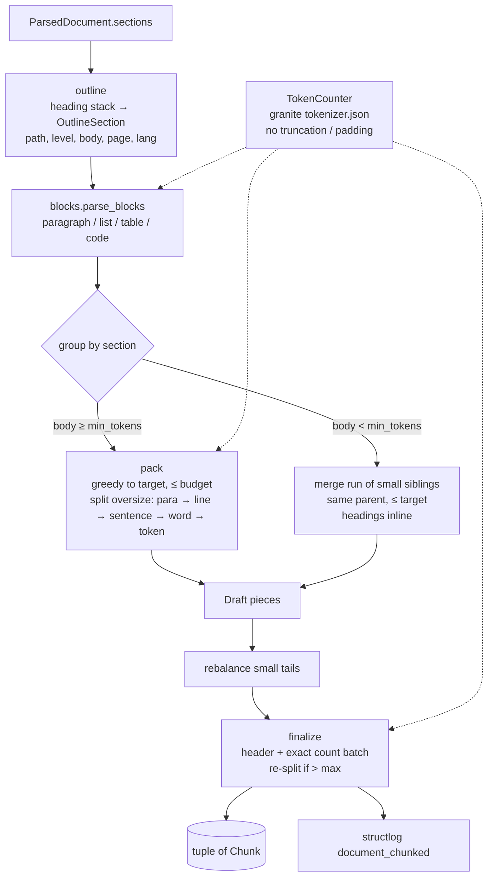

# Design Document: Chunking

## Overview

One pure, synchronous entry point:

```python
chunk_document(doc: ParsedDocument, *, settings: IngestSettings | None = None,
               counter: TokenCounter | None = None) -> tuple[Chunk, ...]
```

The pipeline (`ingest/pipeline.py`, separate spec) calls it in `asyncio.to_thread` right after
`preprocess_*`, then embeds `chunk.embed_text` (dense + BM25 via `fold_for_search`) and stores `text`
plus metadata as the Qdrant payload.

The algorithm, in four passes:

1. **Outline.** Rebuild the heading tree from the `#` lines that `sections.split_markdown` already
   keeps at the top of each section. Each section gets a `heading_path` and a body without its own
   heading line.
2. **Blocks.** Parse each body into blocks (paragraph, list, table, code fence) so that atomic
   structures are never cut by accident.
3. **Group.** Walk the sections in order. A large section is packed into one or more pieces. Runs of
   small sections under the same parent are merged into one piece.
4. **Finalize.** Prepend the contextual header, count tokens exactly with the embedder tokenizer,
   re-split anything over `max_tokens`, and assign `index`, pages, language and `section_index`.

### Measurements that shaped the design

All measurements were taken on 2026-10-10 against `data/parsed/*.md` with the real tokenizers
(throw-away script, nothing committed).

| Finding | Consequence |
|---|---|
| granite `tokenizer.json` ships with **truncation at 32,768 tokens and padding enabled**. Encoding the BBC page 20 times gave exactly 32,768 tokens until `no_truncation()` was called (77,960 after). | `HFTokenCounter` calls `no_truncation()` and `no_padding()` on load. A unit test asserts that a 40k-token text counts above 32,768. |
| Characters per granite token: 2.8 to 3.0 for Arabic articles, 3.6 for the docs page (CSS variables), 4.6 for the English PDF. | Character-based sizing would make Arabic chunks about 1.6× larger in tokens than English ones. Count tokens (Req 6.1). |
| Reranker (bge-reranker-v2-m3, XLM-R) tokens ÷ granite tokens: 0.83 to 0.88 for Arabic, 1.06 for English prose, **1.28 for the code-heavy docs page**. | A 450 granite-token chunk can be about 576 reranker tokens, which is over the 512-token default before the query is even added. **Defaults lowered to target 300 / max 400** (Req 6.3 updated). The retrieval spec must still set the reranker `max_length` to at least 640 (400 × 1.28 + 128 query tokens). |
| `encode_batch` over 3,281 paragraphs (1.2 MB of Arabic) took 0.06 s, and a single 1.2 MB encode took 0.22 s. | Batch-encode every unit once and sum the counts while packing (Req 8.2). Exact re-counting happens only once, on the final chunks. |
| Encodings expose character `offsets`. Arabic `؟` is its own token. | A token-boundary hard split can cut at an offset without decoding, so the text stays byte-faithful. |
| The slide-style PDF gives 44 sections, most under 60 characters (`## 01`, `## 1`, `## 07`). The docs page gives a clean H1 > H2 > H3 tree. The Arabic article has H2 sections of 400 to 1,500 tokens and no H1. | This motivates small-section merging (Req 4), multi-level paths (Req 2.2), and paragraph/sentence splitting (Req 3). |

## Architecture



The budget for the body is `budget = max_tokens - header_tokens(path)`, computed per heading path
and cached, because every chunk in a section shares the same header.

## Components and Interfaces

| File | Responsibility | Key interface |
|---|---|---|
| `ingest/models.py` (extend) | `Chunk` model next to `ParsedDocument` | `Chunk` (see Data Models) |
| `ingest/settings.py` (extend) | `chunk_*` fields and their validation | `IngestSettings.chunk_*`, `chunking_signature(settings, counter) -> str` |
| `ingest/tokens.py` (new) | Token counting with the embedder tokenizer | `TokenCounter` protocol, `HFTokenCounter`, `verify_tokenizer(settings) -> Path`, `get_token_counter(settings)` (cached) |
| `text/sentences.py` (new) | Multilingual sentence and word splitting, lossless | `split_sentences(text) -> list[str]`, `split_words(text) -> list[str]` |
| `ingest/chunk.py` (new) | Outline, blocks, grouping, packing, finalize, logging | `chunk_document(doc, *, settings=None, counter=None)` |
| `ingest/errors.py` (extend) | Startup error when the tokenizer is missing | `TokenizerConfigError(IngestError)`, code `tokenizer_config_error` |
| `scripts/download_models.py` (extend) | Pinned, sha256-verified `tokenizer.json` download | `download_tokenizer(dest)`, `--only tokenizer` |

### `ingest/tokens.py`

```python
class TokenCounter(Protocol):
    def count(self, text: str) -> int: ...
    def count_many(self, texts: Sequence[str]) -> list[int]: ...
    def cut(self, text: str, max_tokens: int) -> tuple[str, str]: ...  # split at a token offset
    @property
    def fingerprint(self) -> str: ...  # sha256 of tokenizer.json, for chunking_signature

class HFTokenCounter:
    def __init__(self, path: Path):  # Tokenizer.from_file; no_truncation(); no_padding()
```

- `count*` use `add_special_tokens=False`. The embedder adds CLS/SEP itself, and the header margin
  absorbs those 2 tokens (`max_tokens=400` is well under the model's 32k and the reranker's 640).
- `cut()` encodes once and uses `offsets[max_tokens - 1][1]` as the character cut. Both halves are
  exact substrings, so `head + tail == text`.
- `verify_tokenizer()` mirrors `ocr.verify_tessdata()`: if the file is missing or unreadable it
  raises `TokenizerConfigError` with the command to run
  (`uv run python scripts/download_models.py --only tokenizer`).
- Pinned source: `ibm-granite/granite-embedding-311m-multilingual-r2` revision
  `44399559930365213510b1ee2eb15ded83374f0e`, `tokenizer.json`, sha256
  `0087c868b33bad550a78a08d19798cfd7f713cde4f020803b8f51f405503e15f` (33.4 MB). Default path
  `$MODELS_DIR/embedder/tokenizer.json`. The pipeline spec later puts the ONNX model in the same
  directory.

### `text/sentences.py`

Pure regex, no new dependency. pysbd has no Arabic rules, and the Arabic RAG study only needs
punctuation-aware boundaries.

- A boundary comes **after** a terminator run `[.!?…؟؛۔]+`, optionally followed by closing
  `"'»”’)]`, and must be followed by whitespace or the end of the text.
- **Not** a boundary when the terminator is `.` and either:
  - the previous token is in an abbreviation set (`e.g`, `i.e`, `etc`, `M`, `Mme`, `Dr`, `Pr`,
    `p`, `cf`, `vs`, `n°`, plus one-letter capitals for initials), or
  - the next character is a digit or lowercase Latin letter (catches `3.5`, `v1.2`, `example.com`).
    Arabic has no case, so for Arabic text only the abbreviation and digit rules apply.
- The returned pieces keep their trailing whitespace, so `"".join(split_sentences(t)) == t`.
  This is the property the coverage test relies on (Req 1.3).
- `split_words` splits after whitespace runs, also lossless.

