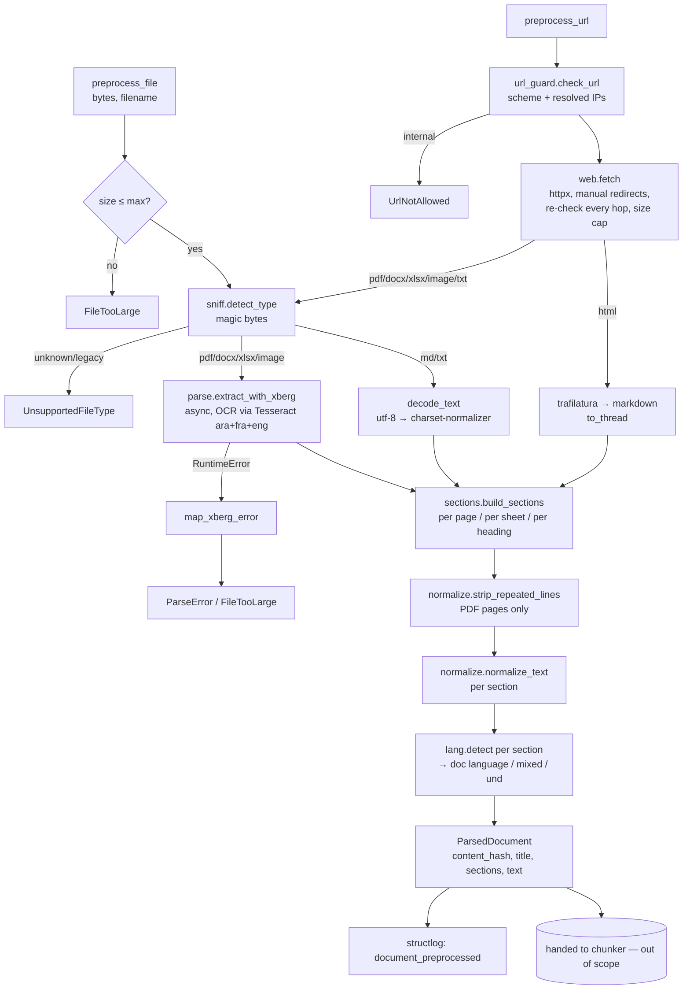

# Design Document — Data Preprocessing (parsing, OCR, web)

## Overview

This phase exposes two async entry points:

```python
await preprocess_file(data: bytes, filename: str, *, visibility, title=None) -> ParsedDocument
await preprocess_url(url: str, *, visibility, title=None) -> ParsedDocument
```

Both run the same steps: **detect type → extract (xberg or trafilatura) → split into sections → normalize →
detect language → assemble `ParsedDocument`**. Every failure surfaces as a typed `IngestError` subclass
carrying a stable `code`, so the (later) `/api/v1/documents` endpoint can map it to the JSON error shape
in the README without knowing parser internals.

### Decisions taken from the requirements' open questions

| Question | Decision |
|---|---|
| Limits | 25 MB/file, 300 pages, 5 MB/web response. The 60 s timeout is a **hang guard**; OCR'd PDFs get an extra per-page budget (see Error Handling). |
| Image formats | PNG, JPEG, TIFF, WEBP. (xberg ships libheif, so HEIC could be added later with a one-line change.) |
| Arabic folding | Yes: `text.normalize.fold_for_search()` is provided here; stored text stays faithful. The indexing stage decides where to apply it. |
| robots.txt, PPTX/HTML files | Dropped from the requirements → not implemented. |

### Findings from probing xberg 1.3.6 (shape the design)

Verified in a throw-away venv with real calls, not taken from docs:

1. **Extension is trusted when content is ambiguous.** Junk bytes named `a.pdf` were routed to the PDF
   parser, and with `mime_detection_policy="content_only"` junk was accepted as `text/plain`.
   → We do our own magic-byte sniffing *before* xberg and pass the MIME type explicitly (Req 2.5).
2. **Missing traineddata does not fail.** With `language=["ara","fra","eng"]` and only `eng` present,
   xberg OCR'd silently; when the network was available it **downloaded** `ara`/`fra` into
   `~/.cache/xberg/tessdata`. → We verify the three files ourselves at startup and pass
   `tessdata_path` explicitly (Req 3.3, 3.4, 7.1).
3. **Tesseract table detection garbles plain notices** into fake Markdown tables.
   → `enable_table_detection=False`, Tesseract `output_format="text"`.
4. **OCR results are cached on disk by default** (`~/.cache/xberg/ocr/*.msgpack`) even with
   `ExtractionConfig.use_cache=False`. → also set `TesseractConfig.use_cache=False`.
5. **Errors are plain `RuntimeError`**, not `xberg.XbergError`, with message prefixes
   (`"Parsing error:"`, `"Security violation:"`, `"Extraction timed out"`). → one mapping function, unit-tested.
6. `extract()` is **natively async** (Rust runtime), so it does not block the event loop.
   `extraction_timeout_secs`, `SecurityLimits.max_pages` and the ZIP-bomb ratio check all work as documented.
7. **Tesseract is bundled** (5.5.3, statically linked) → no `apt install tesseract-ocr` in the image;
   only the traineddata files are needed.
8. A tiny hand-made text PDF (< 64 non-whitespace chars) was OCR'd instead of read natively, because
   xberg's doc-level "near-empty" fallback kicked in. Expected to be a non-issue for real documents, but
   **a test with a realistic text PDF asserts `extraction_method == native`** to catch it if it isn't.

## Architecture



Concurrency: a module-level `asyncio.Semaphore(INGEST_MAX_CONCURRENCY)` (default 1) wraps each
`preprocess_*` call, so two scanned PDFs can't saturate a small CPU box. xberg runs on its own runtime.
CPU-bound pure-Python steps (trafilatura, normalization, langid) run in `asyncio.to_thread` (Req 7.4).

## Components and Interfaces

New files (all under `src/mcclub_rag/`, consistent with the README layout):

| File | Responsibility | Key interface |
|---|---|---|
| `ingest/models.py` | Output contract | `ParsedDocument`, `Section`, `Visibility`, `SourceType` |
| `ingest/errors.py` | Typed errors with stable codes | `IngestError` + subclasses |
| `ingest/settings.py` | Limits & paths (pydantic-settings) | `IngestSettings`, `get_ingest_settings()` |
| `ingest/sniff.py` | Magic-byte type detection | `detect_type(data, filename) -> DetectedType` |
| `ingest/ocr.py` | Tessdata verification + xberg OCR config | `verify_tessdata(settings) -> Path`, `build_xberg_config(settings, page_count) -> ExtractionConfig` |
| `ingest/parse.py` | File → raw extraction | `async extract_file(data, detected, settings) -> RawExtraction`, `decode_text(data) -> str`, `map_xberg_error(exc) -> IngestError` |
| `ingest/sections.py` | Raw extraction → ordered sections | `build_sections(raw) -> list[Section]`, `split_markdown(text, page=None)` |
| `ingest/url_guard.py` | SSRF protection | `async check_url(url, resolve=...) -> None` |
| `ingest/web.py` | Fetch + HTML extraction | `async fetch(url, settings, client=None) -> FetchedResource`, `extract_html(html, url) -> RawExtraction` |
| `ingest/preprocess.py` | Orchestration, `content_hash`, title, logging | `preprocess_file(...)`, `preprocess_url(...)` |
| `text/normalize.py` | Pure text functions | `normalize_text`, `rejoin_hyphens`, `strip_repeated_lines`, `fold_for_search` |
| `text/lang.py` | Language detection | `detect(text) -> LangResult`, `assign_languages(sections) -> str`, `detect_language(text) -> Literal["ar","fr","en"]` (frozen) |
| `scripts/download_models.py` | Build-time tessdata download (sha256-pinned) | `download_tessdata(dest, variant)` |

`ingest/pipeline.py` and `ingest/chunk.py` (README) are **not** part of this spec; `pipeline.py` will call
`preprocess_file` / `preprocess_url`.

### `sniff.detect_type`

Reads at most the first 8 KB, plus the ZIP central directory (names only, nothing decompressed).

| Signature | Result |
|---|---|
| `%PDF-` in first 1024 bytes | `application/pdf` |
| `\x89PNG\r\n\x1a\n` / `FF D8 FF` / `II*\0`, `MM\0*` / `RIFF....WEBP` | `image/png`, `image/jpeg`, `image/tiff`, `image/webp` |
| `PK\x03\x04` + `word/document.xml` | DOCX |
| `PK\x03\x04` + `xl/workbook.xml` | XLSX |
| `PK\x03\x04`, anything else | **Unsupported** (`application/zip`) |
| `D0 CF 11 E0` (OLE2) with `.docx`/`.xlsx` name | **ParseError** "encrypted Office file" (encrypted OOXML is wrapped in OLE2) |
| `D0 CF 11 E0` otherwise | **Unsupported** (`legacy .doc/.xls`) |
| No signature, extension `.md`/`.markdown`/`.txt`, no NUL byte in first 8 KB | `text/markdown` / `text/plain` |
| Anything else | **Unsupported** (`application/octet-stream`) |

The extension only decides between the two text types; it never overrides a binary signature.

### `parse.extract_file`

- **MD/TXT**: decoded in Python, not via xberg. Try `data.decode("utf-8-sig")`; on failure use
  `charset_normalizer.from_bytes(data).best()` (e.g. Windows-1256 Arabic, Latin-1 French). If neither
  decodes → `ParseError("undetectable text encoding")`. `parser="text"`.
- **Everything else**: `xberg.extract(ExtractInput(kind="bytes", bytes=data, mime_type=detected.mime,
  filename=filename), config)`. For PDFs, `xberg.pdf_page_count()` runs first (cheap) to fail fast
  on `max_pages` and to size the timeout.
- xberg config (built once per call by `ocr.build_xberg_config`):

```python
ExtractionConfig(
    use_cache=False,
    output_format="markdown",                 # headings + tables survive (Req 2.2, 2.3)
    pages=PageConfig(extract_pages=True),     # per-page text for page numbers + header/footer removal
    ocr_strategy="auto",                      # page-level routing: OCR only text-less pages (Req 3.2)
    ocr_embedded_images=False,
    pdf_options=PdfConfig(extract_images=False, extract_tables=True, extract_annotations=False),
    security_limits=SecurityLimits(max_pages=s.max_pages),   # ZIP-bomb defaults kept (ratio 100:1)
    extraction_timeout_secs=timeout_s,
    ocr=OcrConfig(
        backend="tesseract",
        language=["ara", "fra", "eng"],
        tessdata_path=str(s.tessdata_prefix),               # verified by verify_tessdata()
        quality_thresholds=OcrQualityThresholds(min_non_whitespace_per_page=s.ocr_min_chars_per_page),
        tesseract_config=TesseractConfig(
            language=["ara", "fra", "eng"], output_format="text",
            enable_table_detection=False, use_cache=False),
    ),
)
```

- `RawExtraction` (internal dataclass): `mime_type`, `parser`, `markdown`, `pages: list[RawPage(number,
  content, sheet_name)]`, `metadata_title`, `ocr_used`, `page_count`, `warnings`.
  `ocr_used = extraction_method in {OCR, MIXED} or metadata.ocr_used`.

### `sections.build_sections`

| Source | Sectioning |
|---|---|
| PDF | Per page (after header/footer removal); inside a page, split on Markdown headings. `page` = page number; `heading` = nearest preceding heading (carried across pages). |
| DOCX | xberg returns one "page" → split on Markdown headings (`#`…`######`), `page=None`. |
| XLSX | One section per sheet, skipping empty ones, `heading=sheet_name`. Rows are rendered as **one self-contained line per row**: `Day: Monday · Activity: Chess` (first non-empty row = header). This keeps header→value pairs intact even if the chunker later splits mid-sheet (Req 2.3). The cells come from `page.tables[].cells`. |
| MD | Split on headings. TXT: a single section. |
| Image | One section, `page=1`. |
| Web HTML | trafilatura Markdown, split on headings. |

Empty sections (after normalization) are dropped. If **no** section remains → `EmptyDocument` (Req 3.6, 4.6).
`text` = `"\n\n".join(section.text)`.

### `url_guard.check_url`

- Scheme must be `http`/`https`; host required; userinfo (`user:pass@`) rejected.
- Resolve with `loop.getaddrinfo(host, port)` (the resolver is injectable for tests). Every resolved address
  must satisfy `ip.is_global and not ip.is_multicast`; IPv4-mapped IPv6 is unwrapped first. This blocks
  127/8, 10/8, 172.16/12, 192.168/16, 169.254/16 (cloud metadata), 100.64/10, ::1, fc00::/7, fe80::/10, etc.
- Called for the initial URL **and every redirect hop** (Req 4.5).
- Known residual risk: DNS rebinding between the check and the connect (TOCTOU). Closing that would
  need a custom httpx transport that pins the vetted IP; it's out of scope here and recorded in EDGE_CASES.md.

### `web.fetch`

- `httpx.AsyncClient(follow_redirects=False, timeout=s.web_timeout_s, headers={"User-Agent": s.web_user_agent})`.
  The client is injectable, so tests use `httpx.MockTransport`.
- Manual redirect loop up to `s.web_max_redirects` (default 5); `Location` is resolved against the current URL and re-checked.
- Streams the body: rejects early on `Content-Length > web_max_bytes`, and aborts when accumulated bytes exceed it.
- Non-2xx → `FetchError(f"HTTP {status}")`; `httpx.TimeoutException` → `FetchError("timeout")`;
  other `httpx.HTTPError` → `FetchError(str)`.
- Returns `FetchedResource(final_url, content_type, data)`.
- Routing in `preprocess_url`: `text/html`/`application/xhtml+xml` → `extract_html`. Anything else goes
  through `sniff.detect_type` + `extract_file` (Req 4.3), with filename = last URL path segment.
  The sniffer remains the authority, so a server lying about its content type is still caught.

### `web.extract_html` (run in a thread)

```python
md = trafilatura.extract(html_bytes, url=final_url, output_format="markdown", include_tables=True,
                         include_comments=False, include_images=False, include_links=False,
                         favor_precision=True)
meta = trafilatura.extract_metadata(html_bytes)   # meta.title (site suffix already stripped)
```

`md is None or blank` → `EmptyDocument`. `parser = f"trafilatura {version}"`.

### `text/normalize.py` (pure, deterministic — Req 5.5)

`normalize_text(s)` applies these steps in order:
1. NFC.
2. `\r\n`, `\r` → `\n`.
3. Remove C0/C1 controls except `\n` and `\t`. Remove zero-width/format characters: U+200B, U+FEFF,
   U+2060, U+00AD (soft hyphen), bidi embeddings/overrides/isolates U+202A–202E and U+2066–2069, and
   LRM/RLM U+200E/U+200F. **Keep ZWNJ U+200C and ZWJ U+200D** (they change Arabic-script shaping).
4. Remove tatweel U+0640 (Req 5.3).
5. `rejoin_hyphens`: `([^\W\d_])-\n([a-zà-ÿ])` → `\1\2` (only before a lowercase Latin letter, so
   "Jean-\nPierre" survives; this doesn't apply to Arabic).
6. NBSP and other Unicode spaces → space; tab → space; collapse runs of spaces; strip line ends.
7. Collapse ≥ 3 newlines → 2 (paragraph breaks preserved).

`strip_repeated_lines(pages: list[str]) -> list[str]` (Req 5.4). Only applies when there are ≥ 3 pages.
- Candidates are the first 3 and last 3 non-empty lines of each page.
- The key is the line lowercased, whitespace collapsed, digits → `#`, so "Page 3 / 12" matches "Page 4 / 12".
- A key seen on ≥ `max(3, ceil(0.6 × n_pages))` pages is removed from those positions.

`fold_for_search(s) -> str` (for the BM25 side only, never stored):
1. casefold.
2. Map ٱ→ا, ى→ي, ة→ه.
3. NFKD, then drop all combining marks (category `Mn`). This also removes Arabic harakat, and
   decomposes أ إ آ ؤ ئ to their bare letters.
4. Remove tatweel.
5. Arabic-Indic and Persian digits → ASCII.
6. NFC.

### `text/lang.py`

- A lazily created module singleton:
  `LanguageIdentifier.from_model_file(MODEL_FILE, norm_probs=True)` + `set_languages(["ar","fr","en"])`.
  This was verified: "ok" → uniform 0.33 (rejected), Arabic → `ar`.
- `detect(text)`: fewer than `lang_min_chars` (20) letters, or probability < `lang_min_prob` (0.5),
  → `"und"`.
- `assign_languages(sections)`: sets `section.language`, then weighs the result by character count.
  - If ≥ 2 languages each cover ≥ `lang_mixed_share` (0.2) of classified characters → `"mixed"`.
  - Otherwise the dominant language.
  - If nothing was classifiable → `"und"` (Req 6.1–6.3).
- `detect_language(text) -> Literal["ar","fr","en"]` is the frozen function the answer layer imports
  for **chat messages** (Req 6.4).
  - If more than 50% of letters are Arabic-script (U+0600–U+06FF, U+0750–U+077F, U+08A0–U+08FF,
    presentation forms) → `"ar"`. This is reliable even on 2-word queries, where langid isn't.
  - Otherwise: the argmax of the ar/fr/en identifier, with no threshold.
  - No letters at all → `lang_default`.
  - Known weak spot: very short Latin queries ("ok merci", "salut") can flip between fr and en.
    It's acceptable because a wrong guess there costs only the reply language.
- Restricting to ar/fr/en means a Spanish page would be labelled fr/en. That's accepted for this corpus.
  The language list is a setting.

### `ingest/preprocess.py`

- `content_hash`: full SHA-256 hex.
  - Files: computed over the **raw bytes**.
  - Web HTML: computed over the **normalized extracted text**, so a page that only changes ads/menus hashes the same (Req 1.2).
  - `doc_id` is **not** produced here. `pipeline.py` derives it from `topic` (see "Boundary with the API side").
- `title` (Req 1.4): caller title → extractor metadata title → first section heading → filename stem /
  URL host+path. Truncated to 200 chars.
- `visibility` is typed `Literal["public","members"]`. Pydantic rejects anything else, and that error
  is re-raised as `InvalidInput` (Req 1.3).
- Measures duration and emits **one** structlog event per document (Req 7.5).

## Data Models

```python
# ingest/models.py
Visibility = Literal["public", "members"]
SourceType = Literal["file", "web"]

class Section(BaseModel, frozen=True):
    text: str
    heading: str | None = None
    page: int | None = None            # 1-based; None when the format has no pages
    language: str | None = None        # ISO 639-1 or "und"

class ParsedDocument(BaseModel, frozen=True):
    content_hash: str                  # sha256 hex of raw bytes (files) / normalized text (web)
    title: str
    source: str                        # original filename, or final URL after redirects
    source_type: SourceType
    mime_type: str
    visibility: Visibility
    language: str                      # "ar" | "fr" | "en" | "mixed" | "und"
    text: str                          # normalized, sections joined by blank lines
    sections: list[Section]
    ocr_used: bool
    parser: str                        # e.g. "xberg 1.3.6", "trafilatura 2.3.1", "text"
    page_count: int | None
    warnings: list[str] = []           # non-fatal parser warnings (e.g. "1 OCR line removed")
    created_at: datetime               # UTC
```

```python
# ingest/settings.py — env-driven, defaults shown
class IngestSettings(BaseSettings):
    tessdata_prefix: Path = Path("/app/models/tessdata")   # env TESSDATA_PREFIX (already set in Dockerfile)
    ocr_languages: list[str] = ["ara", "fra", "eng"]
    ocr_min_chars_per_page: int = 32
    max_file_mb: int = 25
    max_pages: int = 300
    parse_timeout_s: int = 60          # hang guard per document
    ocr_page_timeout_s: int = 10       # extra budget per PDF page / image
    max_concurrency: int = 1
    web_timeout_s: float = 15
    web_max_bytes: int = 5 * 1024 * 1024
    web_max_redirects: int = 5
    web_user_agent: str = "mcclub-rag/0.1 (+document ingestion)"
    lang_codes: list[str] = ["ar", "fr", "en"]
    lang_min_chars: int = 20
    lang_min_prob: float = 0.5
    lang_mixed_share: float = 0.2
    lang_default: Literal["ar", "fr", "en"] = "fr"   # detect_language() when no letters (open question 4)
```

All fields except `tessdata_prefix` are read with the env prefix `INGEST_`. The new variables are
added to `.env.example`. This sits in its own settings class rather than `config.py` to avoid editing a
shared file; `config.Settings` can compose it later.

## Error Handling

```python
class IngestError(Exception):
    code: str; message: str            # message is safe to show to an admin
```

| Error | `code` | Raised when | Suggested HTTP (for the API stage) |
|---|---|---|---|
| `InvalidInput` | `invalid_input` | bad visibility, empty filename/URL | 422 |
| `FileTooLarge` | `file_too_large` | > `max_file_mb`, > `max_pages`, xberg "too many pages" | 413 |
| `UnsupportedFileType` | `unsupported_file_type` | sniffer rejects; message names the detected type | 415 |
| `ParseError` | `parse_error` | corrupt, encrypted, ZIP bomb, undecodable text, other xberg failures | 422 |
| `ParseTimeout(ParseError)` | `parse_timeout` | xberg timeout or outer `wait_for` | 422 |
| `EmptyDocument` | `empty_document` | no non-empty section after normalization (incl. blank OCR) | 422 |
| `FetchError` | `fetch_error` | non-2xx, timeout, too large, too many redirects, network error | 502 |
| `UrlNotAllowed(FetchError)` | `url_not_allowed` | bad scheme, userinfo, internal address on any hop | 400 |
| `OcrConfigError` | `ocr_config_error` | `ara`/`fra`/`eng` traineddata missing or empty — raised by `verify_tessdata()` at startup (Req 3.4) | n/a (startup fails) |

- **`map_xberg_error(exc)`** (single point of truth, unit-tested against the real messages observed):
  - `"Security violation: Document has too many pages"` → `FileTooLarge`
  - other `"Security violation:"` → `ParseError("rejected by safety limits: …")`
  - `"Extraction timed out"` → `ParseTimeout`
  - `"password"`/`"encrypt"` in the message → `ParseError("password-protected file")`
  - anything else (incl. `xberg.XbergError`) → `ParseError` with the first line of the message,
    truncated to 300 chars
  - The original exception is chained (`raise … from exc`) for logs.
- **Timeout budget**: `timeout = parse_timeout_s + ocr_page_timeout_s × pages`, where `pages` is the PDF
  page count or 1 for images (0 otherwise).
  - It is passed to xberg as `extraction_timeout_secs`, and also enforced with
    `asyncio.wait_for(timeout + 5)` as an outer guard.
  - Caveat: cancelling the Python await may not stop xberg's native work; xberg's own timeout is the
    real guard.
- **Startup**: `verify_tessdata()` checks `{lang}.traineddata` exists and is non-empty for every configured
  language. The API's lifespan (later) and `preprocess_file` (first call, cached) both run it.
- **Logging**:
  - Success: `document_preprocessed` with `content_hash, source, source_type, mime_type, page_count, sections,
    chars, ocr_used, language, duration_ms`.
  - Failure: `document_rejected` with `source, error_code, reason, duration_ms`.
  - URLs are logged **without the query string** (it may carry tokens). Document text is never logged (Req 7.5).
- Nothing in this phase catches bare `Exception` except at the xberg boundary, so programming errors still
  surface in tests.

## Build / container changes

- `scripts/download_models.py` gets a `download_tessdata(dest, variant="fast")` step.
  - It fetches `ara`, `fra`, `eng` from `github.com/tesseract-ocr/tessdata_fast` at tag `4.1.0`
    (the same size class xberg itself fetches: ~1.4/1.1/4.1 MB), verifies pinned SHA-256s, and writes to
    `/app/models/tessdata`.
  - The Dockerfile's commented `RUN … download_models.py` line is enabled.
  - `variant="best"` is supported for an Arabic-accuracy A/B test later.
- `pyproject.toml`: add `charset-normalizer` explicitly (already present transitively via trafilatura).
  Add dev-only `pillow`, `openpyxl`, `python-docx` for the fixture generator.

## Testing Strategy

**Unit (fast, no xberg/tessdata needed):**
- `test_sniff.py`: one synthetic byte string per row of the sniff table, including a ZIP that's neither
  DOCX nor XLSX, OLE2, junk named `.pdf`, and `.txt` containing NUL.
- `test_normalize.py`: table-driven cases:
  - control/zero-width/bidi removal; ZWNJ kept; tatweel; NBSP; CRLF
  - hyphen re-join vs "Jean-\nPierre"; paragraph preservation; idempotence
  - `strip_repeated_lines` with page-numbered footers
  - `fold_for_search` on أحمد/احمد, مدرسة/مدرسه, harakat, événement/evenement, ٣ → 3
- `test_lang.py`: ar/fr/en samples, a short string → `und`, a two-section ar+fr doc → `mixed`.
- `test_sections.py`: Markdown splitting, XLSX row rendering, heading carry-over across pages, empty-section dropping.
- `test_url_guard.py`: injected resolver. Covers 127.0.0.1, 10.0.0.5, 169.254.169.254, ::1,
  ::ffff:127.0.0.1, 100.64.0.1, a public IP, `file://`, `ftp://`, `http://user:pw@host`.
- `test_errors.py`: `map_xberg_error` against the exact observed xberg messages.
- `test_preprocess_meta.py`: `content_hash` determinism, title fallback order, visibility validation.

**Integration with real xberg + fixtures (`tests/fixtures/`, generated by `tests/fixtures/make_fixtures.py`
and committed):**
- `text.pdf` (multi-page, realistic length → asserts native, page numbers, footer stripped), `scanned.pdf`,
  `mixed.pdf` (page 1 text, page 2 image → only page 2 OCR'd), `encrypted.pdf`, `corrupt.pdf`
- `doc.docx` (headings + table), `sheet.xlsx` (2 sheets + empty), `notes.md`, `latin1.txt`, `arabic_cp1256.txt`
- `notice.png`, `notice.jpg`, and **`arabic_notice.jpg` / `arabic_scan.pdf`** — real Arabic scans (see open question)
- Limits: the oversize file is generated in-test with a tiny `max_file_mb` override; `max_pages=1` on `text.pdf`.
- OCR tests carry `@pytest.mark.ocr`. They **fail with an instruction** (run
  `uv run python scripts/download_models.py --only tessdata --dest models/tessdata`) rather than skipping,
  if traineddata is absent.
- `verify_tessdata` is tested with a temp dir missing `ara` → `OcrConfigError`.

**Web (no network, Req 8.2):** `httpx.MockTransport` plus an injected resolver. Covers:
- HTML article → boilerplate gone, title, final URL after redirect
- PDF via URL → routed through the file path
- 404, timeout, oversize body (with and without Content-Length)
- redirect to `http://127.0.0.1` → `UrlNotAllowed`
- > 5 redirects
- empty article → `EmptyDocument`

**Coverage of Req 8.3:** a parametrized test asserts every `IngestError` subclass is raised by at least one test (registry check).

## Boundary with the API side (eequaled)

The agreed seam is the frozen signatures in eequaled's spec. This phase touches two of them.

| Frozen signature | Owner | How this spec relates |
|---|---|---|
| `text/lang.py: detect_language(text) -> Literal["ar","fr","en"]` | me | Implemented here (Req 6.4). |
| `ingest/pipeline.py: ingest_file(path, filename, visibility) -> IngestResult`, `ingest_url(url, visibility)` | me | **Not** in this spec. `pipeline.py` (next spec) calls `preprocess_file` / `preprocess_url`, then chunk → embed → upsert. |

What this spec provides that `pipeline.py` needs:
- `ParsedDocument.content_hash` gives the "same topic + same sha256 → `duplicate`" check from eequaled's
  upsert-by-topic design.
- `doc_id` is derived in `pipeline.py` from `topic` (e.g. `uuid5(NAMESPACE, topic)`), so a replaced
  document keeps its id and citations don't rot.
- Default topic: the filename stem (files) or the normalized URL without query string (web).
- Every failure is an `IngestError` with a stable `code` (table above). `pipeline.py` converts it to
  `IngestResult(status="failed", error=<code>)` or re-raises; which one is an open question with eequaled
  (it decides whether a bad upload is a 4xx or a 200 with `status: failed`).
- `IngestSettings` is a separate pydantic-settings class (`INGEST_` prefix), so eequaled's `config.py`
  can compose it without either of us editing the other's fields.

Proposed signature change (needs eequaled's approval): make `ingest_file` / `ingest_url` **`async def`**.
- xberg's `extract()` is natively async.
- A sync wrapper would need `asyncio.run()` inside a threadpool thread. That breaks the module-level
  concurrency semaphore and creates a new event loop per upload.
- FastAPI awaits an async function directly, so the endpoint code doesn't get more complex.

xberg vs kreuzberg (eequaled's "license unclear" flag): xberg 1.3.6 is **MIT** (`License-Expression: MIT`,
copyright Kreuzberg, Inc. — it is Kreuzberg's renamed package).
- Its shipped CycloneDX SBOM lists 923 components with **no GPL/LGPL/AGPL**. There is a little MPL-2.0
  (audio crates we don't use) and one MIT/Apache/LGPL tri-licensed crate.
- The bundled `libheif` (LGPL) is shipped as a separate shared library, which is compatible with plain use.
- The spike above used synthetic files. The real-file spike (3–5 club files including an Arabic PDF) is
  still pending; see open question 1.

## Requirements traceability

| Req | Covered by |
|---|---|
| 1.1–1.4 | `models.py`, `preprocess.py` (content_hash, title, visibility) |
| 2.1–2.4 | `parse.extract_file`, `sections.build_sections`, `decode_text` |
| 2.5 | `sniff.detect_type` |
| 2.6, 2.7 | `map_xberg_error`, size check, `pdf_page_count` + `SecurityLimits.max_pages` |
| 3.1–3.3 | `ocr.build_xberg_config` (`ocr_strategy=auto`, page thresholds, `tessdata_path`) |
| 3.4 | `ocr.verify_tessdata` |
| 3.5 | Tesseract LSTM emits logical order; asserted by the Arabic-scan fixture test |
| 3.6, 4.6 | `EmptyDocument` after normalization |
| 4.1–4.5, 4.7 | `web.fetch`, `url_guard.check_url`, `web.extract_html`, routing in `preprocess_url` |
| 5.1–5.5 | `text/normalize.py` |
| 6.1–6.4 | `text/lang.py` (`detect`, `assign_languages`, `detect_language`) |
| 7.1 | explicit `tessdata_path`, `use_cache=False` (both levels), no other network code |
| 7.2 | dependency list unchanged except `charset-normalizer` (already transitive) |
| 7.3 | timeout budget, `max_pages`, xberg ZIP-bomb limits |
| 7.4 | xberg native async, `to_thread`, semaphore |
| 7.5 | structlog events in `preprocess.py` |
| 7.6 | `IngestSettings` |
| 8.1–8.3 | Testing Strategy above |

## Open questions

1. **Real Arabic scans for fixtures.** PIL can't shape Arabic text without libraqm, so a synthetic image would
   test nothing real. Can you drop 1–2 real (non-sensitive) Arabic or mixed ar/fr scans or phone photos into
   `tests/fixtures/`? Without them, Req 3.5 stays untested.
2. **Shared files.** This design creates `scripts/download_models.py` (tessdata part only) and edits the
   Dockerfile, `pyproject.toml` and `.env.example`. Is eequaled also touching these (embedder/reranker
   downloads)? If so, I'll keep my part to a `download_tessdata()` function they can call.
3. **tessdata `fast` vs `best`.** `fast` is the default for speed. `best` is noticeably better on Arabic
   but ~2–3× slower per page. OK to start with `fast`?
4. **Default reply language** for `detect_language()` when a message has no letters (e.g. "?" or "123"):
   `fr` assumed. Should it be `ar` or `en`?
